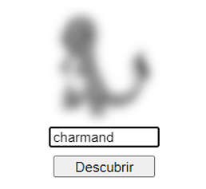
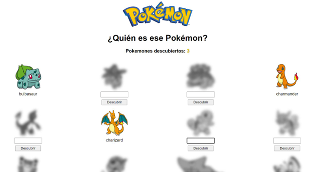
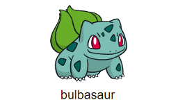
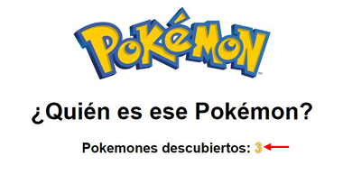
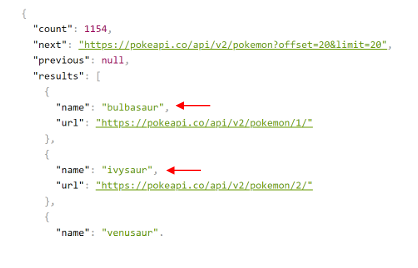

# Desafío Desarrollo de interfaces interactivas con framework Vue

## Introducción

Validaremos nuestros conocimientos del framework Vue Js obtenidos a lo largo de este módulo. Par lograrlo, necesitarás usar todas las competencias aprendidas en las unidades para crear una aplicación con temática de la serie Pokemon haciendo uso de la [PokeAPI](https://pokeapi.co/).

## Descripción

Entre los capítulos de Pokemon aparecía un momento de interacción con los espectadores donde se debía adivinar el nombre de un pokemon viendo solo la silueta.

La aplicación que deberás construir sigue esta misma temática mostrando 20 pokemones cuyas imágenes poseen en primera instancia un filtro que no deja ver con claridad cuál pokemon es.

Para que el usuario intente descubrir y adivinar cada pokemon deberás permitir el ingreso de su nombre por medio de un input debajo de cada una de las imágenes.

Al presionar el botón "Descubrir" o simplemente apretar la tecla Enter, en caso de que el usuario haya escrito correctamente el nombre del pokemon deberá descubrirse quitando el filtro aplicado por defecto, de lo contrario, se debe mostrar una ventana emergente indicando que el nombre ingresado es incorrecto.

Al descubrir un pokemon se deben tomar 2 consideraciones:
1. Ocultar el input y el botón, y dejar el nombre del pokemon al descubierto.

2. Mostrar un contador con la cantidad de pokemones descubiertos hasta el momento.

Consultando el siguiente endpoint podrás ver 20 nombres de pokemones y las URL que te entregará el detalle de cada uno, por lo que no es necesario que conozcas los nombres de los pokemones para realizar este desafío y comprobar su correcto funcionamiento.

https://pokeapi.co/api/v2/pokemon

## Requerimientos

1. Usar las directivas para enlazar variables del estado con el template.
2. Importar y ocupar componentes hijos que reciban datos a través de props.
3. Renderizar dinámicamente componentes hijos usando el v-for.
4. Usar los eventos para agregar interacciones en la aplicación y enlazarlos con métodos locales.
5. Comunicar componentes hijos con su padre para la ejecución de un método.
6. Usar la renderización condicional de elementos para mostrar u ocultar contenido.
7. Asignar condicionalmente estilos o clases por medio del style y class binding.
8. Utilizar Axios para el consumo de la API.
9. Hacer uso del ciclo de vida para ejecutar código al cargar la aplicación.
10. Utilizar computed properties para el procesamiento de datos del estado.